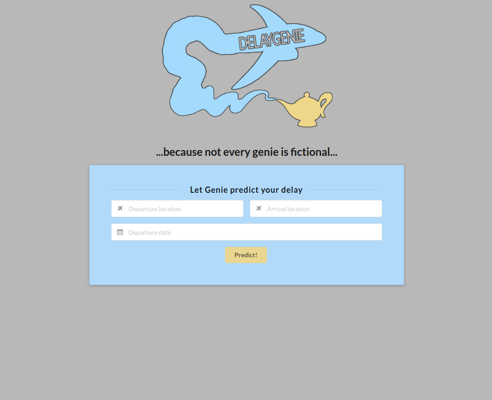
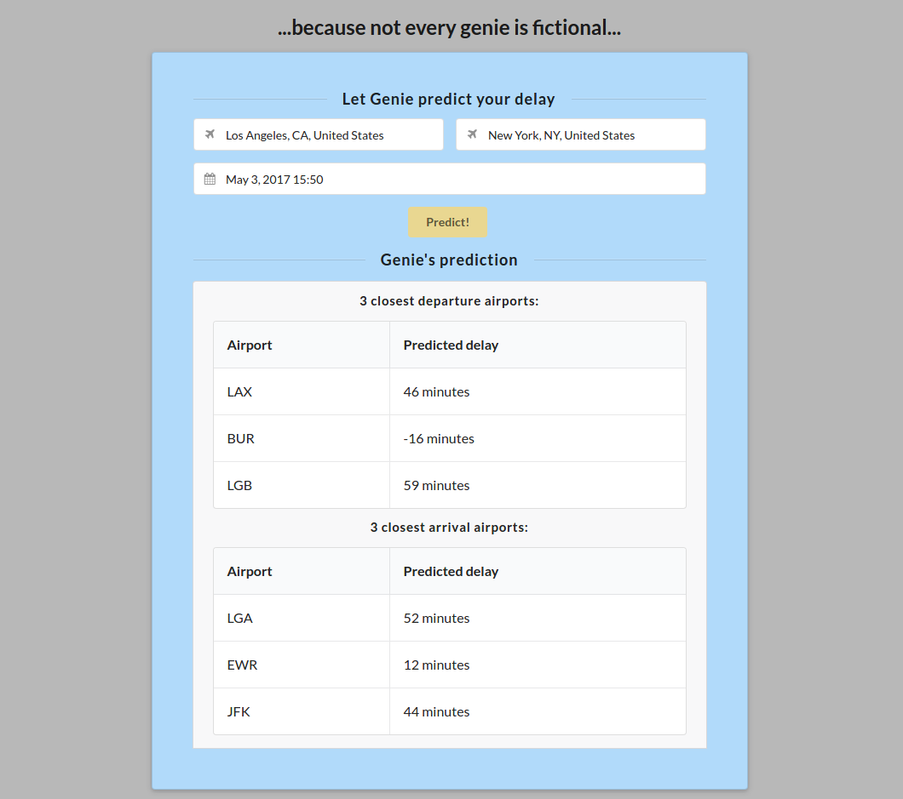

# Delay Genie

## Install / save dependencies
- install: `pip install -r requirements.txt`
- save: `pip freeze > requirements.txt`

## Run project
- `py delay-genie.py`

## Team
- [@wardpauwels](https://github.com/wardpauwels)
- [@JensThiel](https://github.com/JensThiel)
- [@VanhesteOlivier](https://github.com/VanhesteOlivier) -> credits for ML
- [@BenjaVR](https://github.com/BenjaVR)

## Screenshots

